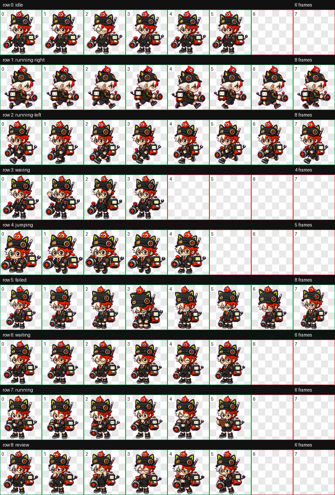

# Luban No.7 Time Journey Codex Pet

An unofficial Codex animated pet inspired by Luban No.7's Time Journey skin from Honor of Kings.

The pet uses a compact pixel-art style and keeps the corrected split front bangs: viewer-left white, viewer-right red.

## Preview

Animated WebP previews are included so the pet can animate directly inside GitHub's README renderer.

| Idle | Running Right | Running Left |
| --- | --- | --- |
|  |  |  |

| Waving | Jumping | Failed |
| --- | --- | --- |
|  |  |  |

| Waiting | Running | Review |
| --- | --- | --- |
|  |  |  |

## Contact Sheet



## Files

- `pet.json` - Codex pet manifest.
- `spritesheet.webp` - Final 8x9 animated pet atlas, 1536x1872 RGBA WebP.
- `qa/contact-sheet.png` - Row-by-row visual review sheet.
- `qa/previews/*.webp` - Animated WebP previews for README display.
- `qa/review.json` - Frame extraction and component QA report.
- `qa/validation.json` - Final atlas validation report.
- `docs/generation-notes.md` - Source links, generation notes, and QA summary.

## Install

Copy this folder into your Codex pets directory:

```bash
mkdir -p ~/.codex/pets/luban7-time-journey
cp pet.json spritesheet.webp ~/.codex/pets/luban7-time-journey/
```

Codex expects `pet.json` and `spritesheet.webp` to live together in the same pet folder.

## Animation Rows

- `idle` - 6 frames
- `running-right` - 8 frames
- `running-left` - 8 frames, generated separately instead of mirrored
- `waving` - 4 frames
- `jumping` - 5 frames
- `failed` - 8 frames
- `waiting` - 6 frames
- `running` - 6 frames, working loop rather than literal travel
- `review` - 6 frames

## Status

Validation passed with no errors or warnings in both `qa/review.json` and `qa/validation.json`.

## Rights

This repository is an unofficial fan-made pet asset. It is not affiliated with or endorsed by Honor of Kings, Tencent, TiMi Studio Group, or any related rights holder.

No open-source license is included by default. See `NOTICE.md` before publishing or redistributing.
